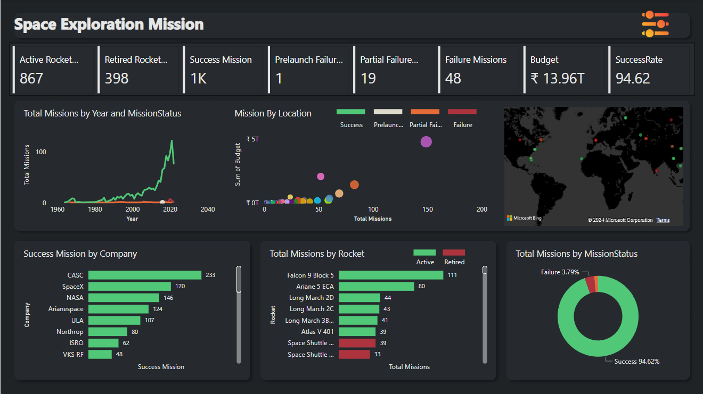

# Exploratory Data Analysis on Space Exploration Missions

Welcome to the Exploratory Data Analysis (EDA) project on Space Exploration Missions! This repository contains Power BI report that analyze data related to space exploration missions.

## Overview

The space exploration missions dataset provides insights into various aspects of space exploration, including rocket status , mission status , countries involved, and launch details. The Power BI reports visualize this data to uncover trends, patterns, and correlations.

## Dashboard Preview

Here is how our dashboard looks:

